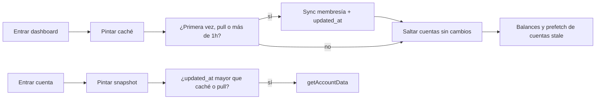

# Caché, refresco condicional y UI optimista

La dirección (mostrar datos ya vistos al instante y refrescar en silencio) es la correcta. Hoy ya hay un stale-while-revalidate **solo en memoria de sesión** en [`src/data/store.ts`](src/data/store.ts): al volver de una cuenta el dashboard no se queda en blanco, pero **al recargar la pestaña se pierde**, la ficha de cuenta **siempre** llama a `getAccountData` (ledger completo) y el alta de gasto **espera** insert + refetch.

## Evaluación de cada idea

**1. Dashboard: nombres ya, saldos de caché o spinner** — Buena idea de UX, con un matiz de red.

- Hoy [`getDashboardData`](src/actions/app.ts) ya pide nombres y saldos **en paralelo** y es barato. Dividirlo en dos viajes **secuenciales** en la primera carga (sin caché) **iría más lento**.
- Lo que sí aporta: **persistir** nombres + saldos, pintar al instante, y poner spinner **por tarjeta** solo si falta el saldo de esa cuenta (cuenta nueva o caché incompleta).
- El spinner de pantalla completa se queda solo para el caso sin ninguna lista cacheada.

**2. Cachear cuentas y buscar nuevas (pull, primera vez, cada 1h); no refrescar si último cambio &lt; última sync** — Buena idea y se puede hacer, pero **hoy no existe “último cambio” usable**.

- [`accounts`](prisma/schema.prisma) no tiene `updated_at`.
- `account_balances.updated_at` existe, pero [`applyBalanceDeltas`](src/actions/app.ts) **no lo escribe** al crear/editar/borrar gastos, y además no cubre socios nuevos, rename, etc.
- Hay que añadir `accounts.updated_at` y mantenerlo (mejor con **trigger** en Postgres, para no olvidarlo en cada action y en los RPC de claim).
- La comparación `último cambio < última actualización del cliente` es exactamente “si el servidor no avanzó, no descargues el ledger”.
- **Membresía (cuentas nuevas/borradas):** pull, primera entrada de sesión (o sin caché) y cada 1h. Entre medias se pueden perder invitaciones hasta 1h; es el trade-off que aceptas.
- **Datos de cuentas ya conocidas:** en cada entrada al dashboard, query barata de `id, updated_at` y solo entonces saldos/prefetch de las stale.

**3. Al entrar al dashboard, prefetch de balances para que la ficha sea instantánea** — Buena idea si prefetch es el **snapshot de la cuenta** (miembros, saldos de todos, gastos, apuntes), no solo el número del dashboard.

- El número del dashboard **no** basta para pintar [`AccountPage.tsx`](src/app/(app)/account/[id]/AccountPage.tsx).
- Prefetch de **todas** las cuentas con `getAccountData` en cada visita es mala idea: cada llamada son ~5 queries Neon y hay rate limit de Auth.
- Hacerlo solo para cuentas **stale**, con cola de concurrencia 1–2, en idle.

**4. Al entrar en una cuenta, usar caché; refrescar solo si fecha último balance &gt; caché, o pull en la lista** — Buena idea; usar `accounts.updated_at`, no “fecha de último balance”.

- Un socio nuevo o un gasto borrado no siempre cambian *tu* fila de balance.
- Hoy **no hay pull-to-refresh**; hay que añadirlo en dashboard (página) y en la lista de gastos (el bloque que marcaste).
- [`AccountDataProvider`](src/app/(app)/account/[id]/AccountDataProvider.tsx) vive en el layout de `/account/[id]`: al salir se desmonta. El snapshot tiene que subir a Zustand.

**5. Insert optimista al añadir gasto** — Muy buena idea y totalmente viable; es el cambio de fluidez más notable.

- Hoy [`ExpensePage.handleSave`](src/app/(app)/account/[id]/expense/ExpensePage.tsx) bloquea con overlay, espera `addTransactionAction` y **después** `refetch`.
- Flujo nuevo: aplicar tx + entries + deltas de saldo en caché → navegar a la lista → insert en segundo plano → sustituir id temporal por el real. Si falla, rollback y alerta.
- Editar/borrar se pueden dejar esperando al servidor en este pase (no los pediste).

## Cambio de esquema (imprescindible para el skip)

- Prisma + Drizzle: `accounts.updated_at TIMESTAMPTZ NOT NULL DEFAULT now()`.
- SQL en [`prisma/sql/pg-features.sql`](prisma/sql/pg-features.sql) + migración: trigger que ponga `accounts.updated_at = now()` en insert/update de `transactions`, `transaction_entries`, `account_members`, `account_balances` (el soft-delete de gastos es un `UPDATE` y queda cubierto).
- En JS, [`applyBalanceDeltas`](src/actions/app.ts) también debe enviar `updated_at` al tocar saldos (por si el trigger no corre en algún path Data API).
- Al renombrar un participante ([`updateParticipantNameAction`](src/actions/app.ts) / nombre propio si es miembro), tocar `accounts.updated_at` de las cuentas afectadas: si no, la lista mostraría nombres viejos.

## Caché en Zustand (persistida)

Ampliar [`src/data/store.ts`](src/data/store.ts) (`partialize` hoy solo `currentUser` + `language`):

- Dashboard: `dashboardAccounts`, `dashboardBalances`, `dashboardBalanceStatus` (`ready` | `loading` por id), `lastMembershipSyncAt`, `accountSyncedAt[id]`.
- Snapshots: `accountCache[id] = { data, syncedAt, serverUpdatedAt }`.
- Clave por `userId`; `clearDashboard` / logout siguen vaciando todo.
- Persistir dashboard + snapshots (tamaño típico de grupos compartidos es pequeño). No persistir flags de loading.

## Dashboard

En [`DashboardPage.tsx`](src/app/(app)/dashboard/DashboardPage.tsx):

- Pintar caché al hidratar. Sin lista: spinner de página. Con lista y saldo faltante: skeleton/spinner en el número.
- Componente ligero de pull-to-refresh (sin librería nueva), sobre el scroll de la página.
- Sync membresía si: sin caché, pull, o `now - lastMembershipSyncAt > 1h`.
- Siempre (en background, si hay ids cacheados): `select id, name, icon_key, currency, updated_at` de esas cuentas; si `updated_at <= accountSyncedAt[id]`, no pedir saldo ni prefetch.
- Cuentas nuevas: aparecer con spinner de saldo; pedir solo esos ids.
- Cuentas que ya no estás: quitar de la lista.
- Tras saldos frescos: actualizar caché y `accountSyncedAt`.
- Prefetch: `getAccountData` en cola para ids stale, `setAccountCache`.

Nuevas actions delgadas (o un `getDashboardMeta` que sustituya el `select("*")` actual):

- Meta: miembros + cuentas (`id, name, icon_key, currency, updated_at`).
- Saldos: `account_balances` filtrado por `user_id` + ids stale.

## Ficha de cuenta

- [`AccountDataProvider`](src/app/(app)/account/[id]/AccountDataProvider.tsx) lee `accountCache[id]`.
- Si hay snapshot: hijos al instante (sin pantalla de carga). Si no: skeleton usando nombre/saldo del dashboard si existen.
- Refetch completo solo si no hay caché, `serverUpdatedAt` del meta &gt; `syncedAt`, o pull en la lista de [`AccountPage.tsx`](src/app/(app)/account/[id]/AccountPage.tsx).
- API `applyLocalAccountPatch` / `rollback` para el optimista.

## Alta de gasto

- `addTransactionAction` debe devolver `{ id, created_at, ... }` (hoy solo `{ success: true }`).
- Quitar la espera de `refetch` antes de navegar; el overlay de “guardando” desaparece (o es un indicador no bloqueante).
- Deltas locales = `paid - owed`, igual que el servidor.
- Si el insert ok: reemplazar el id temporal; no hace falta `getAccountData` salvo que el servidor discrepe.
- Si falla: revertir tx, entries y saldos (cuenta + dashboard) y `showAlert`.

## Qué no haremos

- React Query / SWR como librería: el store ya cubre el caso.
- Prefetch agresivo de todas las cuentas en cada visita.
- Dos round-trips secuenciales nombres→saldos en la primera carga sin caché.
- Invalidar solo con `account_balances.updated_at` (se queda corto).
