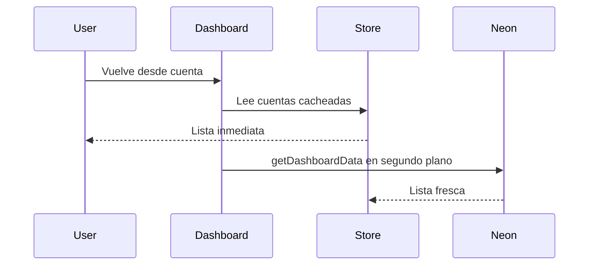

# Acelerar la carga del Dashboard

El cuello de botella no es pintar las tarjetas: al salir de `/account/[id]`, [DashboardPage.tsx](src/app/dashboard/DashboardPage.tsx) se remonta con estado vacío y **bloquea toda la UI** hasta que `getDashboardData` vuelve de Neon. Zustand ya es un singleton de sesión: si el listado vive ahí, sobrevive al cambio de ruta.

No añadir React Query ni pasar el Dashboard a RSC: el `userId` vive en el persist de cliente y el store ya cubre el caso.

## 1. Cache de sesión en Zustand (impacto alto)

En [store.ts](src/data/store.ts), añadir estado **no persistido** (partialize: solo `currentUser` y `language`):

- `dashboardUserId`, `dashboardAccounts`, `dashboardBalances`
- `setDashboardData(userId, accounts, balances)`
- `patchDashboardAccount(accountId, { name, icon, balance })` para el saldo de la cuenta abierta
- `removeDashboardAccount(accountId)` para el borrado optimista
- `clearDashboard()` en `logout`

Así el cache muere al recargar la pestaña (saldos no se quedan días desfasados) pero **sí sobrevive cuenta → dashboard**.

## 2. Dashboard: pintar cache y refrescar en silencio

En [DashboardPage.tsx](src/app/dashboard/DashboardPage.tsx):

- Leer cuentas/saldos del store en lugar de `useState` local.
- Spinner de página completa **solo** si no hay cache para ese `userId`.
- Si hay cache: mostrar la lista al instante y llamar `getDashboardData` en segundo plano; sustituir al terminar.
- Tras `deleteAccountAction` con éxito: quitar la tarjeta del store y luego refrescar (no esperar a Neon para que desaparezca).
- El `hasDataRef` actual sobra: el store es esa memoria.

## 3. Actualizar el cache desde la cuenta abierta

Cuando [AccountDataProvider.tsx](src/app/account/[id]/AccountDataProvider.tsx) recibe datos, parchear esa cuenta en el dashboard (nombre, icono, saldo del usuario actual). Al volver, el saldo de **esa** cuenta ya está al día; el resto se corrige con el refetch silencioso.

Invalidar también al crear cuenta o unirse ([CreateAccountPage.tsx](src/app/create-account/CreateAccountPage.tsx), [JoinPage.tsx](src/app/join/[token]/JoinPage.tsx)): no hace falta prefetch extra; basta con que el siguiente `getDashboardData` rellene, o un `patch` mínimo si se tiene el id nuevo.

## 4. Atrás de la ficha de cuenta → `/dashboard`

[Header.tsx](src/components/layout/Header.tsx) usa `router.back()`, que no prefetch y puede no ir al Dashboard (historial interno de gastos/saldos).

- En la ficha de cuenta ([AccountPage.tsx](src/app/account/[id]/AccountPage.tsx)): `onBack` → `router.push("/dashboard")` (o `backHref`).
- Saldos, gasto, participantes y compartir siguen con `router.back()` hacia la ficha.

El tab Cuentas de [BottomNav.tsx](src/components/layout/BottomNav.tsx) ya es un `Link` a `/dashboard`; no hace falta prefetch extra de datos (el cache cubre el hueco).

## 5. Recorte menor en Neon (opcional, bajo impacto)

En `getDashboardData` ([actions/app.ts](src/actions/app.ts)): pedir solo columnas usadas (`id, name, icon_key, currency` y `account_id, balance`) en vez de `select("*")`. La cascada members → accounts+balances se deja: el cliente Data API no usa joins y el cache evita que el usuario la espere.

No tocar el token anónimo ni añadir librerías.

## Verificación

Sin datos cacheados (primera visita o logout): spinner como ahora, luego lista.

Con datos: dashboard → cuenta (cambiar un gasto) → atrás: lista **inmediata** y saldo de esa cuenta ya actualizado; el resto se refresca sin parpadear a pantalla de carga.

Borrar una cuenta: la tarjeta desaparece al confirmar; el resto de la lista no se vacía.

Logout: el cache se limpia; otro usuario no ve cuentas ajenas.
