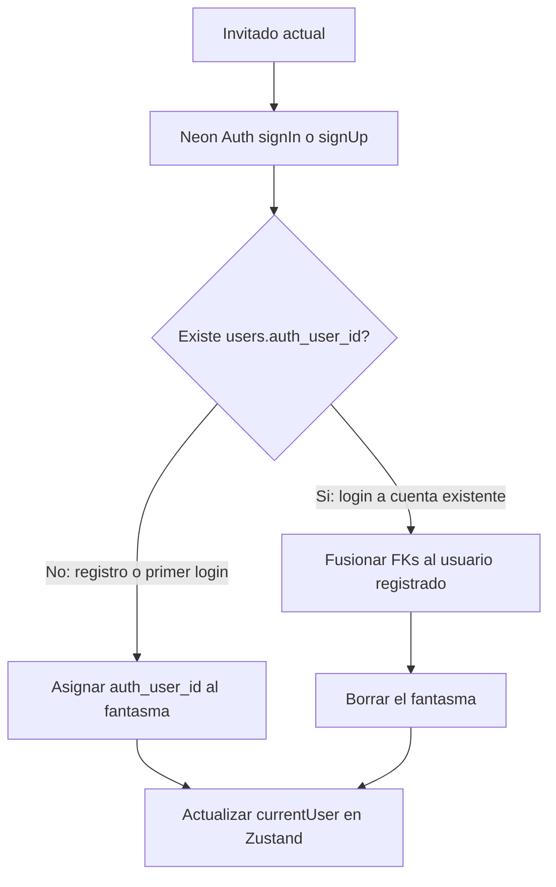

# Perfil: cuenta e idioma

## Contexto

- Un invitado de sesión es un `users` con `auth_user_id` NULL (`is_ghost` es columna generada) **y** `user_secrets`. La sesión vive en Zustand persistido ([src/data/store.ts](src/data/store.ts)). Los placeholders de participantes (ghosts sin secret, creados con `addParticipantAction`) no se reclaman.
- Login/registro en [src/app/WelcomePage.tsx](src/app/WelcomePage.tsx) está **stubbeado**. [src/data/neonClient.ts](src/data/neonClient.ts) tiene Better Auth (`signUp.email` / `signIn.email`) pero **ningún consumidor** hoy; Data API usa JWT anónimo.
- i18n existe en [src/i18n/index.ts](src/i18n/index.ts) (es/en) pero casi no se usa: nadie importa el módulo en el layout, la UI está en español fijo y el default de i18n es `en`.

## 1. Iniciar sesión / registrarse desde Perfil (invitado)

Solo visible si `currentUser.is_ghost`. Reutilizar el patrón de pestañas de Welcome (Entrar / Registro: email, contraseña; registro también pide nombre).

**Registro (o login sin fila en `users`):** no se crea otro usuario. Se hace `UPDATE users SET auth_user_id = …` sobre el fantasma. `is_ghost` pasa a false solo. Se conserva el mismo `id` y `session_secret`, así las cuentas no cambian de dueño.

**Login a un usuario ya registrado:** hay que reasignar **todas** las FKs del fantasma y luego borrarlo. Unicidades que chocan si ambos están en la misma cuenta:

- `account_members (account_id, user_id)`
- `transaction_entries (transaction_id, user_id)`
- `account_balances (account_id, user_id)`

Función SQL atómica `merge_ghost_into_user(ghost_id, target_id)` en [prisma/sql/pg-features.sql](prisma/sql/pg-features.sql) (Data API no tiene transacción multi-tabla). Orden:

1. `accounts.created_by` y `transactions.created_by` → target
2. Apuntes solapados: sumar `paid_amount`/`owed_amount` en la fila del target, borrar la del fantasma; el resto `UPDATE user_id`
3. Saldos solapados: sumar y borrar; el resto `UPDATE user_id`
4. Miembros solapados: si el fantasma era `owner`, promover al target; borrar membresía fantasma; el resto `UPDATE user_id`
5. `DELETE FROM users WHERE id = ghost_id` (cascade de `user_secrets`)

Action de servidor (p. ej. `claimOrMergeGhostAction` en [src/actions/app.ts](src/actions/app.ts)):

- Exigir `session_secret` del fantasma (evitar fusionar otro usuario).
- Verificar el JWT de Neon Auth en servidor (`GET {NEON_AUTH_URL}/get-session`) y usar ese `auth_user_id`, no el que mande el cliente.
- Devolver el usuario resultante (`id`, `display_name`, `is_ghost: false`, `session_secret`) para `setCurrentUser`.

Auth en cliente vía `neonClient` (Better Auth). Tras éxito, actualizar Zustand; si el `id` cambia (merge), el dashboard ya carga por `currentUser.id`.

También **activar** login/registro en WelcomePage (hoy no se puede crear un usuario registrado, así que el login desde Perfil no tendría destino). Welcome no fusiona: si ya hay `currentUser`, redirige al dashboard.

Si Neon Auth responde Invalid Origin, hay que añadir el origen (localhost / preview) en la consola de Neon Auth; no es un bug de UI.

## 2. Cambiar idioma

- Selector en Perfil: Español / English.
- Preferencia en Zustand persistido (`language: 'es' | 'en'`), default **`es`** (hoy la UI y `<html lang="es">` son español).
- Provider cliente que importe i18n, llame `i18n.changeLanguage` y actualice `document.documentElement.lang`.
- Extraer strings a [src/i18n/locales/es.json](src/i18n/locales/es.json) y [en.json](src/i18n/locales/en.json); `useTranslation()` en las pantallas.

Pantallas a traducir: Welcome, Dashboard, Perfil, Crear cuenta, cuenta (detalle, gasto, saldos, participantes, compartir, [AccountDataProvider](src/app/account/[id]/AccountDataProvider.tsx)), unirse, BottomNav, Header, not-found, AlertProvider.

Fechas: `date-fns` `format(..., 'MMM dd')` hoy sale en inglés; pasar `locale` (`es` / `enUS`) según el idioma.

Los errores de server actions pueden quedarse en español en esta iteración (o devolver códigos y traducir en cliente si sale barato).

## Archivos principales

- [src/app/profile/ProfilePage.tsx](src/app/profile/ProfilePage.tsx) — formularios + selector de idioma
- [src/app/WelcomePage.tsx](src/app/WelcomePage.tsx) — auth real
- [src/data/neonClient.ts](src/data/neonClient.ts) — signIn/signUp
- [src/actions/app.ts](src/actions/app.ts) — claim/merge
- [prisma/sql/pg-features.sql](prisma/sql/pg-features.sql) — `merge_ghost_into_user`
- [src/data/store.ts](src/data/store.ts) — `language`
- [src/i18n/index.ts](src/i18n/index.ts) + locales + provider en [src/app/layout.tsx](src/app/layout.tsx)

## Verificación

No hay herramientas de navegador en esta sesión: comprobar flujos con el dev server (Welcome registro/login, Perfil como invitado registro vs login con cuenta que ya tiene grupos, cambio es/en en varias rutas). Si hay origen inválido de Neon Auth, documentarlo.
