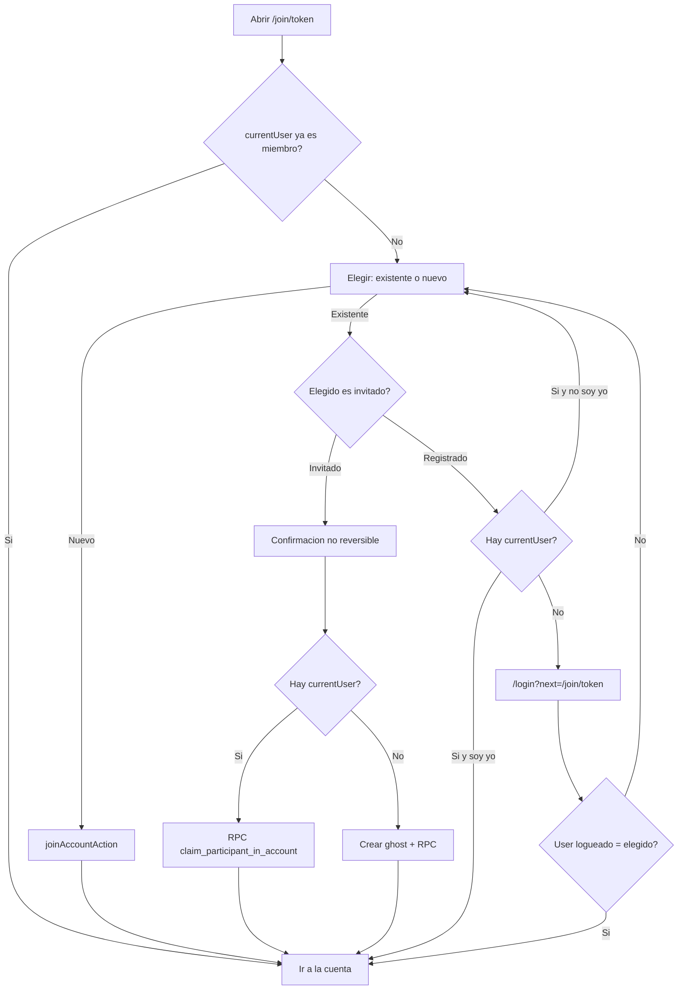

# Reclamar participante al unirse

Hoy [`JoinPage.tsx`](src/app/(app)/join/[token]/JoinPage.tsx) siempre crea un miembro nuevo. Los placeholders añadidos en Participantes (“podrá unirse más tarde con el enlace”) nunca se asocian. Eso es lo que hay que cerrar, sin quitar la opción de entrar como persona nueva.

## Flujo UI

En join, la lista pasa a ser un selector (todos los miembros, no solo 3):

- Invitado (`is_ghost`): se puede elegir.
- Registrado: se puede elegir solo si **no** hay sesión; si hay sesión y no eres tú, queda deshabilitado (no se puede “ser” otra cuenta registrada).
- Opción extra: **Soy un participante nuevo** (nombre solo si no hay `currentUser`).

Si al cargar `currentUser.id` ya está en la cuenta: redirigir a `/account/{id}` sin tocar nada (casuística 1).

Confirmación con [`useAlert().showConfirm`](src/components/common/AlertProvider.tsx) (`isDestructive: true`) **antes de reclamar a un invitado**: deja claro que ocuparás su sitio en gastos y saldos, que la persona que lo usaba como invitado perderá el acceso a **esta** cuenta, y que **no es reversible**.

## Casuísticas cubiertas

**Las 4 que pediste**

1. **Ya asociado** → no-op, ir a la cuenta.
2. **Con sesión + elige invitado** → confirmación → reasignar esta cuenta al `currentUser` (ghost o registrado) → borrar al invitado **solo si no le quedan membresías**. El front no borra usuarios.
3. **Sin sesión + elige invitado** → crear un ghost nuevo (mismo `display_name` que el elegido, con `user_secrets`) → misma RPC → borrar al anterior **solo si no le quedan cuentas**.
4. **Sin sesión + elige registrado** → `/login?next=/join/{token}`. Tras login, si el usuario es ese participante → casuística 1. Si entra con otra cuenta → vuelve al selector.

**Extra que hay que tratar (si no, salen bugs o robos de identidad)**

5. **Con sesión + elige a otro registrado** → no se reclama. Fila deshabilitada: “Ese participante ya tiene cuenta”.
6. **Invitado con otras cuentas** → no usar [`merge_ghost_into_user`](prisma/sql/pg-features.sql) (es **global** y te entregaría todos sus grupos). Transferencia **solo de esta cuenta**. El DELETE del invitado queda en la RPC si tras el traspaso `account_members` del origen está vacío. Así el caso 2 y el 3 comparten la misma regla de borrado (la del punto 3). Si el origen sigue en otros grupos, sobrevive; solo pierde esta cuenta.
7. **Carrera: dos personas reclaman al mismo invitado** → `SELECT … FOR UPDATE` del miembro origen. El segundo recibe error “ya fue reclamado”; el cliente refresca la lista.
8. **El elegido deja de existir** (lo quitaron de Participantes) → error de servidor, refrescar preview.
9. **Owner invitado** → permitido (elegiste todos los `is_ghost`). La membresía `owner` y `accounts.created_by` de **esta** cuenta pasan al destino. El aviso debe ser igual de claro.
10. **No basta con cambiar `account_balances`** → hay que reasignar también `account_members`, `transaction_entries` de esta cuenta y `transactions.created_by` de esta cuenta. Si no, las FK `RESTRICT` impiden borrar al invitado y los gastos seguirían apuntando al id viejo.
11. **Tras reclamar, el saldo del dashboard no es 0** → la action debe devolver el `balance` traspasado para `patchDashboardAccount`.
12. **Login de vuelta** → [`WelcomePage.tsx`](src/app/(app)/login/WelcomePage.tsx) hoy manda siempre a `/dashboard` y, si ya hay `currentUser`, ni siquiera muestra el form. Si viene `next` (ruta interna `/join/...`): respetarlo; tab Login por defecto; no crear invitado en ese retorno.

## Backend (nada de DELETE en el cliente)

Nueva función SQL atómica `claim_participant_in_account(p_account_id, p_source_id, p_target_id)` en [`prisma/sql/pg-features.sql`](prisma/sql/pg-features.sql), con `GRANT EXECUTE` a `anonymous`/`authenticated` (Data API no transacciona varias tablas). Tras añadirla hay que aplicarla en la BD (`pnpm db:dev:features` en local).

La función:

- Exige `p_source_id != p_target_id`, origen `is_ghost`, origen miembro de esa cuenta; destino existente.
- Si el destino **ya** es miembro: no-op de reclamo (casuística 1).
- Reasigna solo filas de `p_account_id` (mismo patrón de colisión que el merge global: sumar entries/saldos si ambos cayeran en la misma cuenta, promover `owner`).
- `DELETE FROM users WHERE id = source` **únicamente** si el origen sigue siendo ghost y no queda ninguna fila en `account_members`.
- Nunca toca otras cuentas del origen.

Nueva action `claimParticipantAction` en [`src/actions/app.ts`](src/actions/app.ts):

- Resuelve la cuenta por `invite_token`.
- Si hay sesión: verifica `session_secret` del destino (hoy `joinAccountAction` no autentica al caller; en claim sí hace falta).
- Si no hay sesión: crea el ghost en servidor y usa ese id como destino (el cliente no inventa el id a borrar).
- Rechaza si el origen no es ghost (el registrado se resuelve por login, no por RPC).
- Llama a la RPC; no hace `delete` de `users` desde TypeScript.

Ajustes menores:

- [`getAccountPreviewAction`](src/actions/app.ts): devolver `id`, `display_name`, `is_ghost` (no `select("*")` / no `auth_user_id`).
- [`joinAccountAction`](src/actions/app.ts): seguir para “soy nuevo”; exigir `session_secret` del `userId`.

## Frontend e i18n

- [`JoinPage.tsx`](src/app/(app)/join/[token]/JoinPage.tsx): selector, confirmación, ramas join vs claim vs login.
- [`WelcomePage.tsx`](src/app/(app)/login/WelcomePage.tsx): query `next` seguro (solo paths relativos `/join/...`).
- Claves nuevas en [`src/i18n/locales/es.json`](src/i18n/locales/es.json) y [`en.json`](src/i18n/locales/en.json) (elegir participante, soy nuevo, invitado/registrado, aviso irreversible, errores de reclamo, inicia sesión como X).

## Verificación en el navegador

- Ya miembro → entra directo a la cuenta.
- Sesión registrada + reclamar invitado (con gastos) → saldos/gastos quedan en el usuario logueado; el invitado desaparece de Participantes.
- Sin sesión + reclamar invitado → nueva sesión ghost, mismo historial; el placeholder se borra si no está en otras cuentas.
- Invitado que también está en otra cuenta → esa otra cuenta no cambia; el usuario origen sigue existiendo.
- Sin sesión + registrado → login y vuelta al join/cuenta si coincide; si entra con otra cuenta, no hereda esa identidad.
- Soy nuevo (con y sin sesión) sigue funcionando.
- Dos pestañas reclamando el mismo invitado: una OK, la otra error.
- Confirmación destructiva visible antes de reclamar.